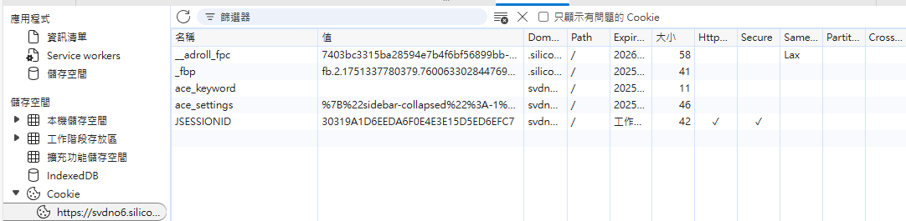

# SVD-ACE Handler 


SVD-ACE Handler is a cmd tool and also a python class,which had define a object oriented  method to manipulate the SMI SVD testing platform by using web like post get method in computer network.  


It is used by Jenkins as a python now , but it can be execute by other program or job scheduler .
## setup & execute
### how to setup 

### requirement 
a python(I use python3.8) env

```sh 
#install all needed package
pip install -r requirements.txt
```

### how to used 

```sh 
usage: SVD-ACEHandler.py [-h] -sys SYSTEM (-pjn PROJECT_NAME | -pjb PROJECT_NUMBER) [-c CONFIG] [-a ACCOUNT] [-p PASSWORD]
                         [-pth FIRMWARE_PATH] [-v VERSION] [-tv TEST_LEVEL] [-nn NODE_NUMBER] [-cmd NODE_COMMAND]

SVD ACE Handler CLI

optional arguments:
  -h, --help            show this help message and exit
  -sys SYSTEM, --system SYSTEM
                        System ID (e.g., VCT6)
  -pjn PROJECT_NAME, --project_name PROJECT_NAME
                        Project Name (e.g., RT_ACE6600_DVT_Web_Test)
  -pjb PROJECT_NUMBER, --project_number PROJECT_NUMBER
                        Project Number (e.g., 26)
  -c CONFIG, --config CONFIG
                        Config file path (default: ./.config)
  -a ACCOUNT, --account ACCOUNT
                        Account name
  -p PASSWORD, --password PASSWORD
                        Password
  -pth FIRMWARE_PATH, --firmware_path FIRMWARE_PATH
                        Firmware bin file path (e.g., ../ace.bin)
  -v VERSION, --version VERSION
                        Firmware version (optional)
  -tv TEST_LEVEL, --test_level TEST_LEVEL
                        Firmware version (optional)
  -nn NODE_NUMBER, --node_number NODE_NUMBER
                        Node number (optional, for node command)
  -cmd NODE_COMMAND, --node_command NODE_COMMAND
                        Node command (e.g., init, reboot, etc.)

```


## how to fullfull

### reflash_cookies
``` py
class SVDACEHandler:
    def __init__():
        ......
        self.session = requests.Session()
```
To acess the SMI SVD test system via API , using session object(keep the vaild cookies)!



>reflash the cookies before execute each function when class is instanclice, so that the cookies is not expired.  


```python 
 def _reflash_cookies(self,account,password)-> None:
        """
        follow the web SVD ACE login process and let the session object have vaild cookies
        Args:
            account (str): SSO account
            password (str): SSO password
        """
```
> mainly do reflash this cookies by which ace platform 
###

``` python 
def node_command(self, node_id: int, command: str) -> bool:
        '''
        order node to execute command
        Args:   
            node_id (int): node id
            command (str): shell command for example "init" , "interrupt" or any other command which could be executed on the node terminal
        Returns:
            bool: True if command executed successfully, False otherwise
        '''
```
### function describition

####  

#### 

